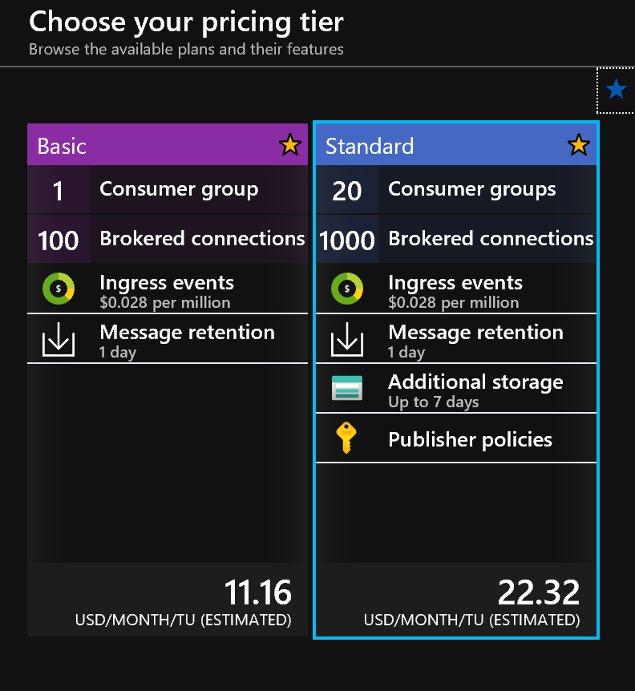
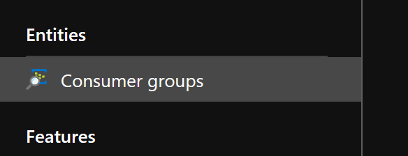
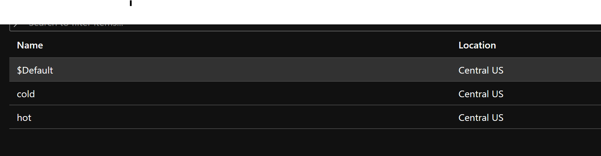

# Hackathon Prerequisites 

The following resources are implemended during the hackathon, please ensure your have the ability to create in your subscription or resource group:

- Azure Storage Account - Blob 
- Azure Event Hubs
- Azure Stream Analytics
- Azure Logic Apps
- Azure Service Bus
- Azure SQL Database

_A [Twillio](https://www.twilio.com/) account is used in this tutorial to send SMS text for alerting._

The following will need to be completed before proceeding to step 1

## Azure Portal

Azure subscription. If you don't have one, create a [free account](https://azure.microsoft.com/en-us/free/) before you begin.

## [Create Resource Group](https://docs.microsoft.com/en-us/azure/event-hubs/event-hubs-create#create-a-resource-group)

A resource group is a logical collection of Azure resources. All resources are deployed and managed in a resource group. To create a resource group:

## Azure Event Hubs

Azure Event Hubs will be the architecural component for our streaming ingest. 

### [Create an Event Hubs Namespace](https://docs.microsoft.com/en-us/azure/event-hubs/event-hubs-create#create-an-event-hubs-namespace)

We will be using the Standard pricing tier to demonstrate the use of multiple [consumer groups](https://docs.microsoft.com/en-us/azure/event-hubs/event-hubs-features#consumer-groups).

 

An Event Hubs namespace provides a unique scoping container, referenced by its fully qualified domain name, in which you create one or more event hubs.

An __Event Hubs namespace__ provides a unique scoping container, referenced by its fully qualified domain name, in which you create one or more event hubs or Kafka topics.

### [Create and Event Hub](https://docs.microsoft.com/en-us/azure/event-hubs/event-hubs-create#create-an-event-hub)

__Azure Event Hubs__ is a scalable event processing service that ingests and processes large volumes of events and data, with low latency and high reliability.

__Add Consumer Groups__

After createing the Event Hub we will want to add two consumer groups, one for the hot path and one for the cold path:

Go to Consumer Groups

 

Add the hot and cold consumer groups

 

Once you are complete with the prereqs, move on to [Step 1](../01-DataLoad/) if you will be creating a stream with the provided 'mock' data or jump to [Step 2](../02-StreamHot) if loading your own data.