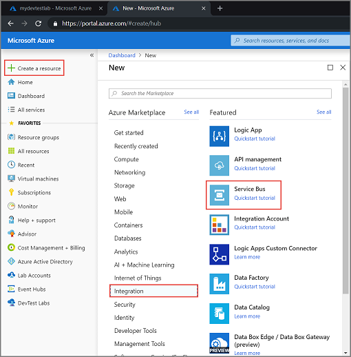
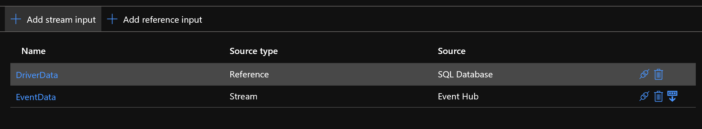
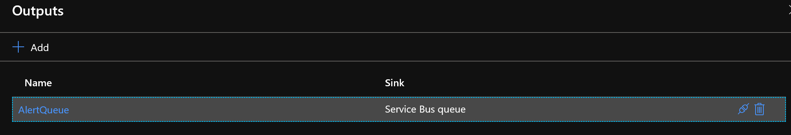
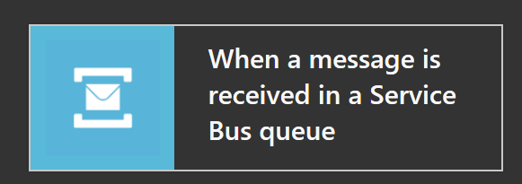
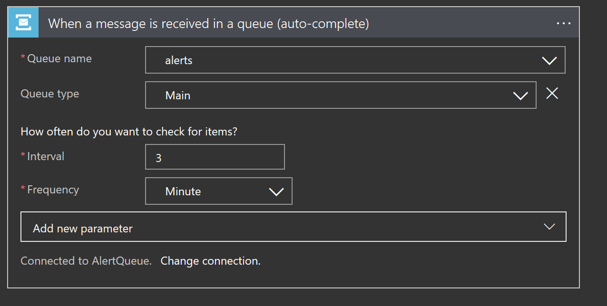
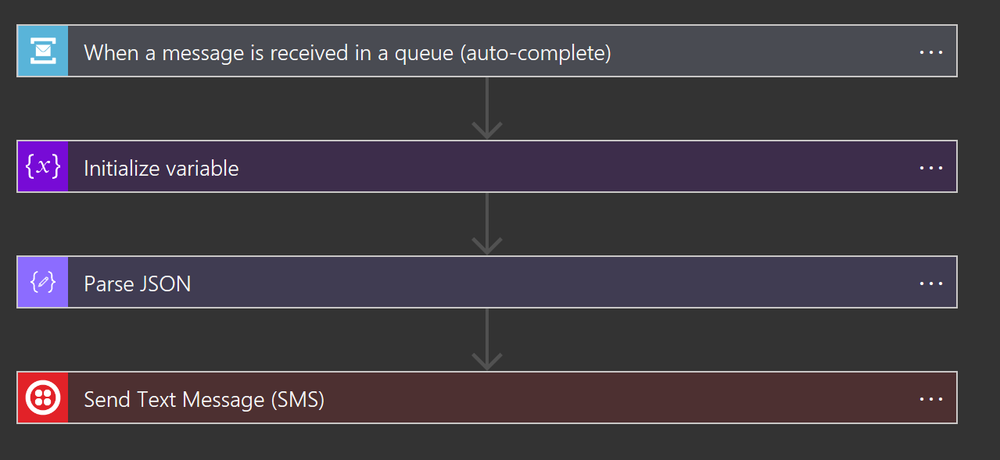
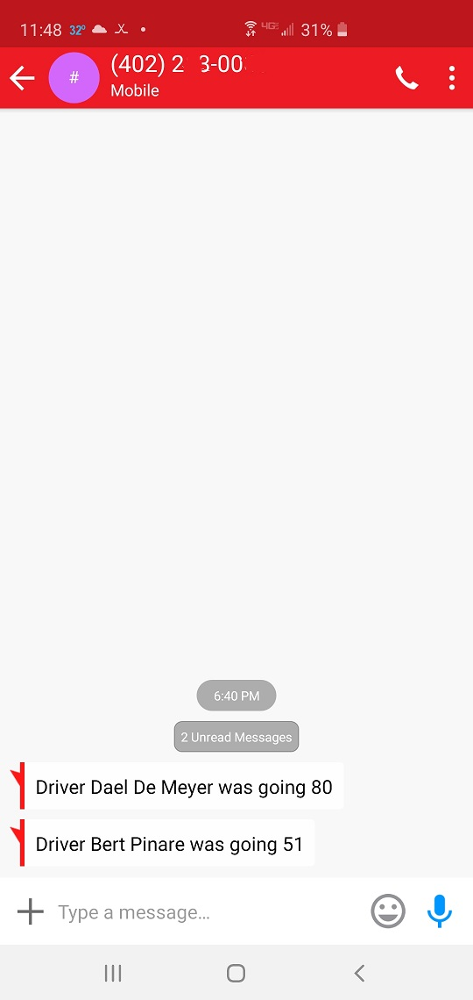

# Stream Processing with Azure Stream Analytics - Hot Path

## Set-Up Service Bus Queue

### Namespace

To begin using Service Bus messaging entities in Azure, you must first create a namespace with a name that is unique across Azure. A namespace provides a scoping container for addressing Service Bus resources within your application.

To create a namespace:

1. Sign in to the Azure portal

2. In the left navigation pane of the portal, select + Create a resource, select Integration, and then select Service Bus.

3. In the Create namespace dialog, do the following steps:

    a. Enter a name for the namespace. The system immediately checks to see if the name is available. For a list of rules for naming namespaces, see Create Namespace REST API.

    b. Select the Basic pricing tier.

    c. For Subscription, choose an Azure subscription in which to create the namespace.

    d. For Resource group, choose an existing resource group in which the namespace will live, or create a new one.

    e. For Location, choose the region in which your namespace should be hosted.

    f. Select Create. The system now creates your namespace and enables it. You might have to wait several minutes as the system provisions resources for your account.

### Queue

1. On the Service Bus Namespace page, select Queues in the left navigational menu.

2. On the Queues page, select + Queue on the toolbar.

3. Enter a name for the queue, and leave the other values with their defaults.

4. Now, select Create.

## Create Azure Stream Analytics for Hot Path

1. Sign in to the Azure portal.

2. Select Create a resource in the upper left-hand corner of the Azure portal.

3. Select Analytics > Stream Analytics job from the results list.

4. Fill out the Stream Analytics job page with the following information:

|Setting|Suggested value|Description|
|-----------------------|---------------------------------|---------------------------------------------------------------------------------|
|Job name|MyASAJob|Enter a name to identify your Stream Analytics job. Stream Analytics job name can contain alphanumeric characters, hyphens, and underscores only and it must be between 3 and 63 characters long.|
|Subscription|Your subscription|Select the Azure subscription that you want to use for this job.|
|Resource group|asaquickstart-resourcegroup|Select the same resource group as your IoT Hub.|
|Location|Select the region that is closest to your users|Select geographic location where you can host your Stream Analytics job. Use the location that's closest to your users for better performance and to reduce the data transfer cost.|
|Streaming units|1|Streaming units represent the computing resources that are required to execute a job. By default, this value is set to 1. To learn about scaling streaming units, refer to understanding and adjusting streaming units article.|
|Hosting environment|Cloud|Stream Analytics jobs can be deployed to cloud or edge. Cloud allows you to deploy to Azure Cloud, and Edge allows you to deploy to an IoT Edge device.|

5. select Create.

### Inputs

Add Inputs for our Event Hub and for the Reference Driver data loaded during our last step.

**What Consumer Group will we use?**

### Outputs

Add out Service Bus Output for alerting

**Let's record the alerts to an Azure Storage Account**

 Please refer to the [Azure Stream Analytics Query docs](https://docs.microsoft.com/en-us/azure/stream-analytics/stream-analytics-stream-analytics-query-patterns) to deelop your notification and reference join query.

## Azure Logic Apps for Notifications

1. From the Azure home page, in the search box, find and select Logic Apps.

2. On the Logic Apps page, select Add.

3. On the Logic App pane, provide details about your logic app as shown below. After you're done, select Create.

|Property|Value|Description|
|--------|------|-----------------------------------------------------|
|Name|logic-app-name|Your logic app name, which can contain only letters, numbers, hyphens (-), underscores (_), parentheses ((, )), and periods (.). This example uses "My-First-Logic-App". |
|Subscription|Azure-subscription-name|Your Azure subscription name |
|Resource group|Azure-resource-group-name|The name for the Azure resource group used to organize related resources. This example uses "My-First-LA-RG".|
|Location|Azure-region|The region where to store your logic app information. This example uses "West US".|
|Log Analytics|Off|Keep the Off setting for diagnostic logging. |

4. After Azure deploys your app, on the Azure toolbar, select Notifications > Go to resource for your deployed logic app.

Or, you can find and select your logic app by typing the name in the search box.

The Logic Apps Designer opens and shows a page with an introduction video and commonly used triggers. We will select 'when service bus message received'

**Our Logic App will parse the JSON alert message from the Service Bus Queue and then perform an alert step. The workflow below uses Twillio to send SMS texts**

